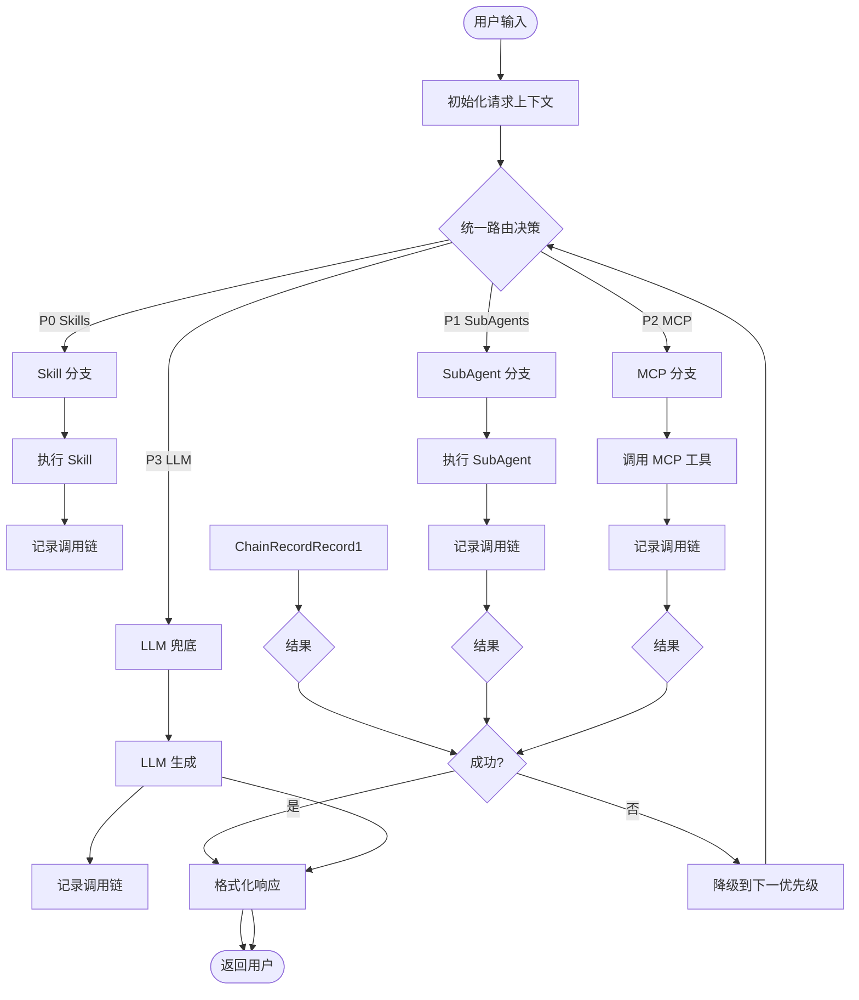
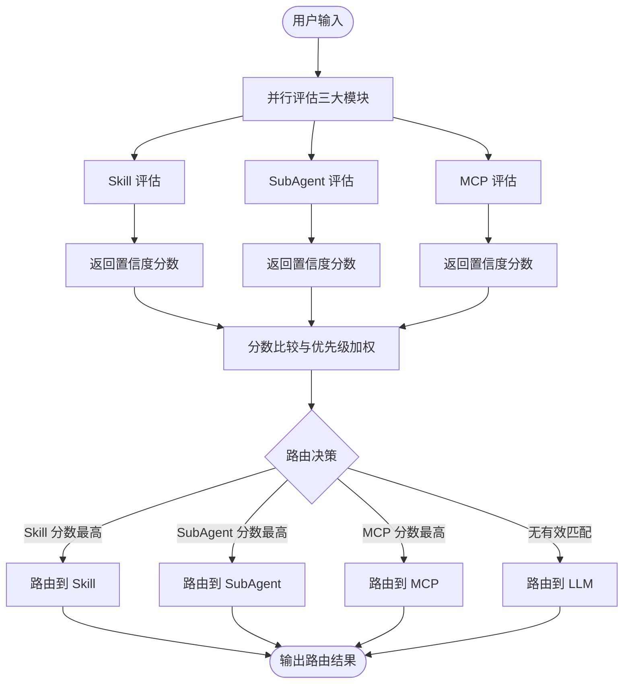

# SubAgent/MCP 路由架构设计

> **设计者**: 架构师 Agent
> **日期**: 2026-03-20
> **版本**: 1.0.0

---

## 一、设计概述

### 1.1 背景分析

当前系统状态：
- ✅ **Skills 模块**: 已集成到 StreamAgent，有意图识别和调用链追踪
- ✅ **SubAgent 模块**: 有 Orchestrator 和 can_handle() 评分机制，但未接入
- ✅ **MCP 模块**: 有 Client 和传输层，但无意图识别和路由

核心问题：
1. 三大模块（Skills/SubAgents/MCP）各自独立，缺乏统一路由
2. 意图识别仅支持 Skills，无法识别 SubAgent 和 MCP 调用场景
3. 调用链追踪未覆盖 SubAgent 和 MCP
4. 缺乏优先级和冲突处理机制

### 1.2 设计目标

1. **统一路由决策**: Skills、SubAgents、MCP 参与同一竞争机制
2. **扩展意图识别**: 支持识别 SubAgent 和 MCP 的调用场景
3. **调用链传播**: Skill 调用 MCP/SubAgent 时正确记录链路
4. **优先级管理**: 明确的优先级和冲突解决策略

---

## 二、路由流程图

### 2.1 整体路由流程



### 2.2 意图识别流程



---

## 三、核心接口设计

### 3.1 统一路由器 (UnifiedRouter)

```python
"""
统一路由器 - 负责协调 Skills/SubAgents/MCP 的路由决策
"""

from typing import Optional, Dict, Any
from dataclasses import dataclass
from enum import Enum

class ModuleType(Enum):
    """模块类型"""
    SKILL = "skill"
    SUBAGENT = "subagent"
    MCP = "mcp"
    LLM = "llm"

@dataclass
class RouteDecision:
    """路由决策结果"""
    module_type: ModuleType
    module_name: str
    confidence: float
    metadata: Dict[str, Any]

class UnifiedRouter:
    """
    统一路由器

    职责：
    1. 并行评估所有模块的置信度
    2. 根据优先级和分数选择最佳路由
    3. 处理冲突和降级逻辑
    """

    def __init__(
        self,
        intent_recognizer: 'IntentRecognizer',
        subagent_orchestrator: 'SubAgentOrchestrator',
        mcp_client: 'MCPClient'
    ):
        self._intent_recognizer = intent_recognizer
        self._subagent_orchestrator = subagent_orchestrator
        self._mcp_client = mcp_client

        # 优先级配置 (数字越小优先级越高)
        self._priority = {
            ModuleType.SKILL: 0,
            ModuleType.SUBAGENT: 1,
            ModuleType.MCP: 2,
            ModuleType.LLM: 999
        }

    async def decide(self, user_input: str, context: Dict[str, Any]) -> RouteDecision:
        """
        路由决策

        流程：
        1. 并行评估所有模块
        2. 应用优先级加权
        3. 选择最佳路由

        Args:
            user_input: 用户输入
            context: 上下文信息

        Returns:
            RouteDecision: 路由决策
        """
        # 并行评估
        skill_result = await self._evaluate_skill(user_input)
        subagent_result = await self._evaluate_subagent(user_input)
        mcp_result = await self._evaluate_mcp(user_input)

        # 决策
        candidates = [
            (skill_result, ModuleType.SKILL),
            (subagent_result, ModuleType.SUBAGENT),
            (mcp_result, ModuleType.MCP)
        ]

        # 过滤低置信度
        valid_candidates = [
            (result, mt) for result, mt in candidates
            if result and result['confidence'] >= 0.3
        ]

        if not valid_candidates:
            return RouteDecision(
                module_type=ModuleType.LLM,
                module_name="llm",
                confidence=0.0,
                metadata={}
            )

        # 按优先级和置信度排序
        # 优先级相同时选置信度高的
        best_result, best_type = min(
            valid_candidates,
            key=lambda x: (self._priority[x[1]], -x[0]['confidence'])
        )

        return RouteDecision(
            module_type=best_type,
            module_name=best_result['name'],
            confidence=best_result['confidence'],
            metadata=best_result.get('metadata', {})
        )

    async def _evaluate_skill(self, user_input: str) -> Optional[Dict]:
        """评估 Skill 匹配度"""
        result = self._intent_recognizer.recognize(user_input)
        if result.skill_name:
            return {
                'name': result.skill_name,
                'confidence': result.confidence,
                'metadata': {
                    'matched_keywords': result.matched_keywords
                }
            }
        return None

    async def _evaluate_subagent(self, user_input: str) -> Optional[Dict]:
        """评估 SubAgent 匹配度"""
        from ..subagent import SubAgentInput

        input_data = SubAgentInput(query=user_input)
        best_score = 0.0
        best_agent = None

        for agent_id, agent in self._subagent_orchestrator._agents.items():
            try:
                score = agent.can_handle(input_data)
                if score > best_score:
                    best_score = score
                    best_agent = agent_id
            except Exception:
                pass

        if best_agent and best_score >= 0.3:
            return {
                'name': best_agent,
                'confidence': best_score,
                'metadata': {}
            }
        return None

    async def _evaluate_mcp(self, user_input: str) -> Optional[Dict]:
        """评估 MCP 匹配度"""
        # MCP 通过工具描述匹配
        # 这里简化处理：检查是否包含特定关键词

        mcp_keywords = {
            'filesystem': ['文件', '读取', '写入', 'file', 'read', 'write'],
            'github': ['github', '仓库', 'repo', 'issue', 'pr'],
            # 可扩展更多服务器
        }

        user_input_lower = user_input.lower()
        best_match = None
        best_score = 0.0

        for server_name, keywords in mcp_keywords.items():
            score = sum(1 for kw in keywords if kw in user_input_lower)
            if score > best_score:
                best_score = score
                best_match = server_name

        if best_match and best_score >= 1:
            return {
                'name': best_match,
                'confidence': min(best_score * 0.3, 1.0),  # MCP 置信度稍低
                'metadata': {}
            }
        return None
```

### 3.2 扩展的意图识别器

```python
"""
扩展意图识别器 - 支持识别 SubAgent 和 MCP 调用场景
"""

from typing import Optional, Dict, Any
from dataclasses import dataclass

@dataclass
class ExtendedIntentResult:
    """扩展意图识别结果"""
    target_type: str  # 'skill', 'subagent', 'mcp', 'llm'
    target_name: Optional[str]
    confidence: float
    metadata: Dict[str, Any]

class ExtendedIntentRecognizer(IntentRecognizer):
    """
    扩展意图识别器

    继承原有 IntentRecognizer，增加 SubAgent 和 MCP 识别
    """

    def __init__(
        self,
        skills_dir: str = "skills",
        subagent_orchestrator: 'SubAgentOrchestrator' = None,
        mcp_client: 'MCPClient' = None
    ):
        super().__init__(skills_dir)
        self._subagent_orchestrator = subagent_orchestrator
        self._mcp_client = mcp_client

    def recognize_extended(self, user_input: str) -> ExtendedIntentResult:
        """
        扩展意图识别

        同时评估 Skill/SubAgent/MCP，返回最佳匹配
        """
        results = []

        # 1. Skill 识别
        skill_result = self.recognize(user_input)
        if skill_result.skill_name:
            results.append({
                'type': 'skill',
                'name': skill_result.skill_name,
                'confidence': skill_result.confidence,
                'metadata': {'matched_keywords': skill_result.matched_keywords}
            })

        # 2. SubAgent 识别
        if self._subagent_orchestrator:
            subagent_result = self._recognize_subagent(user_input)
            if subagent_result:
                results.append(subagent_result)

        # 3. MCP 识别
        if self._mcp_client:
            mcp_result = self._recognize_mcp(user_input)
            if mcp_result:
                results.append(mcp_result)

        # 选择最佳匹配
        if not results:
            return ExtendedIntentResult(
                target_type='llm',
                target_name=None,
                confidence=0.0,
                metadata={}
            )

        # 按置信度排序，优先级加成
        priority_weights = {'skill': 1.2, 'subagent': 1.1, 'mcp': 1.0}
        best = max(
            results,
            key=lambda x: x['confidence'] * priority_weights.get(x['type'], 1.0)
        )

        return ExtendedIntentResult(
            target_type=best['type'],
            target_name=best['name'],
            confidence=best['confidence'],
            metadata=best.get('metadata', {})
        )

    def _recognize_subagent(self, user_input: str) -> Optional[Dict]:
        """识别 SubAgent 调用"""
        from ..subagent import SubAgentInput

        input_data = SubAgentInput(query=user_input)
        best_score = 0.0
        best_agent = None

        for agent_id, agent in self._subagent_orchestrator._agents.items():
            try:
                score = agent.can_handle(input_data)
                if score > best_score:
                    best_score = score
                    best_agent = agent_id
            except Exception:
                pass

        if best_agent and best_score >= 0.3:
            return {
                'type': 'subagent',
                'name': best_agent,
                'confidence': best_score,
                'metadata': {}
            }
        return None

    def _recognize_mcp(self, user_input: str) -> Optional[Dict]:
        """识别 MCP 调用"""
        # 基于工具描述的语义匹配
        # 这里简化为关键词匹配

        mcp_tools = self._mcp_client.list_all_tools()

        user_input_lower = user_input.lower()
        best_match = None
        best_score = 0.0

        for server_name, tools in mcp_tools.items():
            for tool in tools:
                description = tool.get('description', '').lower()
                name = tool.get('name', '').lower()

                # 简单的关键词匹配
                if any(word in description or word in name for word in user_input_lower.split()):
                    score = 1.0
                    if score > best_score:
                        best_score = score
                        best_match = server_name

        if best_match and best_score >= 0.5:
            return {
                'type': 'mcp',
                'name': best_match,
                'confidence': best_score * 0.8,  # MCP 置信度打折
                'metadata': {}
            }
        return None
```

### 3.3 调用链传播机制

```python
"""
调用链传播器 - 支持嵌套调用的链路追踪
"""

class ChainTracker:
    """
    扩展调用链追踪器

    新增功能：
    1. 支持嵌套调用链（Skill 调用 MCP）
    2. 支持链式调用追踪
    3. 支持调用深度限制
    """

    def __init__(self, max_depth: int = 5):
        self._chain: List[ChainInfo] = []
        self._max_depth = max_depth
        self._depth = 0

    def enter(self, source_type: str, source_name: str, confidence: float = 0.0) -> 'ChainContext':
        """
        进入调用上下文

        Returns:
            ChainContext: 调用上下文管理器
        """
        if self._depth >= self._max_depth:
            logger.warning(f"调用链深度超过限制 ({self._max_depth})")
            return ChainContext(self, False)

        self._depth += 1
        self._chain.append(ChainInfo(source_type, source_name, confidence))
        return ChainContext(self, True)

    def exit(self, success: bool) -> None:
        """
        退出调用上下文

        Args:
            success: 调用是否成功
        """
        if self._depth > 0:
            self._depth -= 1
            if not success:
                # 失败的调用从链中移除
                self._chain.pop()

    @contextmanager
    def track(self, source_type: str, source_name: str, confidence: float = 0.0):
        """
        调用链追踪上下文管理器

        Usage:
            with tracker.track("skill", "my-skill", 0.9):
                # 执行代码
                pass
        """
        ctx = self.enter(source_type, source_name, confidence)
        try:
            yield ctx
            self.exit(True)
        except Exception:
            self.exit(False)
            raise

@dataclass
class ChainContext:
    """调用上下文"""
    tracker: ChainTracker
    active: bool

    def __enter__(self):
        return self

    def __exit__(self, exc_type, exc_val, exc_tb):
        if exc_type is None:
            self.tracker.exit(True)
        else:
            self.tracker.exit(False)
```

---

## 四、集成到 StreamAgent

### 4.1 修改后的 StreamAgent

```python
"""
集成统一路由的 StreamAgent
"""

class StreamAgent:
    """
    流式 Agent（统一路由版本）

    支持：
    - Skills 意图识别
    - SubAgents 路由
    - MCP 工具调用
    - 统一调用链追踪
    """

    def __init__(
        self,
        session_id: str,
        llm_client: Optional[LLMClient] = None,
        memory: Optional[ConversationMemory] = None,
        skills_dir: str = "skills"
    ):
        self.session_id = session_id
        self._llm_client = llm_client or self._create_llm_client()
        self._memory = memory or get_memory_manager()
        self._skills_dir = skills_dir

        # 统一能力系统（延迟初始化）
        self._unified_router: Optional[UnifiedRouter] = None
        self._capabilities_initialized = False

        # 调用链追踪
        self._chain_tracker = ChainTracker(max_depth=5)

    def _init_capabilities(self) -> None:
        """初始化统一能力系统"""
        if self._capabilities_initialized:
            return

        try:
            # 初始化 Skill 系统
            intent_recognizer = IntentRecognizer(self._skills_dir)
            skill_executor = SkillExecutor(self._skills_dir)

            # 初始化 SubAgent 系统
            subagent_orchestrator = SubAgentOrchestrator(llm_client=self._llm_client)
            await subagent_orchestrator.initialize()

            # 初始化 MCP 系统
            mcp_client = MCPClient()
            await mcp_client.initialize()

            # 创建统一路由器
            self._unified_router = UnifiedRouter(
                intent_recognizer=intent_recognizer,
                subagent_orchestrator=subagent_orchestrator,
                mcp_client=mcp_client
            )

            # 保存组件引用
            self._skill_executor = skill_executor
            self._subagent_orchestrator = subagent_orchestrator
            self._mcp_client = mcp_client

            self._capabilities_initialized = True
            logger.info(f"Session {self.session_id}: 统一能力系统已初始化")

        except Exception as e:
            logger.warning(f"能力系统初始化失败: {e}")

    async def chat_stream(
        self,
        user_input: str,
        include_history: bool = True
    ) -> AsyncGenerator[str, None]:
        """
        流式对话（统一路由版本）

        流程：
        1. 初始化能力系统
        2. 路由决策
        3. 执行对应模块
        4. 追踪调用链
        5. 返回结果
        """
        # 初始化能力系统
        self._init_capabilities()

        # 路由决策
        decision = await self._unified_router.decide(user_input, {})

        # 根据路由决策执行
        if decision.module_type == ModuleType.SKILL:
            async for chunk in self._execute_skill(decision, user_input):
                yield chunk
        elif decision.module_type == ModuleType.SUBAGENT:
            async for chunk in self._execute_subagent(decision, user_input):
                yield chunk
        elif decision.module_type == ModuleType.MCP:
            async for chunk in self._execute_mcp(decision, user_input):
                yield chunk
        else:
            async for chunk in self._execute_llm(user_input, include_history):
                yield chunk

        # 追加调用链签名
        signature = self._chain_tracker.format_signature()
        for char in signature:
            yield char

        # 清空调用链
        self._chain_tracker.clear()

    async def _execute_skill(
        self,
        decision: RouteDecision,
        user_input: str
    ) -> AsyncGenerator[str, None]:
        """执行 Skill"""
        with self._chain_tracker.track("skill", decision.module_name, decision.confidence):
            context = SkillContext(
                session_id=self.session_id,
                user_input=user_input,
                intent="",
                metadata=decision.metadata
            )

            result = await self._skill_executor.execute(decision.module_name, context)

            if result.success:
                for char in result.response:
                    yield char
            else:
                # Skill 失败，降级到 LLM
                async for chunk in self._execute_llm(user_input, True):
                    yield chunk

    async def _execute_subagent(
        self,
        decision: RouteDecision,
        user_input: str
    ) -> AsyncGenerator[str, None]:
        """执行 SubAgent"""
        with self._chain_tracker.track("subagent", decision.module_name, decision.confidence):
            from ..subagent import SubAgentInput

            input_data = SubAgentInput(query=user_input)
            result = await self._subagent_orchestrator.route(input_data)

            if result.success:
                for char in result.response:
                    yield char
            else:
                # SubAgent 失败，降级到 LLM
                async for chunk in self._execute_llm(user_input, True):
                    yield chunk

    async def _execute_mcp(
        self,
        decision: RouteDecision,
        user_input: str
    ) -> AsyncGenerator[str, None]:
        """执行 MCP 工具调用"""
        with self._chain_tracker.track("mcp", decision.module_name, decision.confidence):
            # 这里需要 LLM 解析参数
            # 简化版本：直接返回提示信息
            yield f"[MCP] 需要调用 {decision.module_name}，参数解析待实现"

    async def _execute_llm(
        self,
        user_input: str,
        include_history: bool
    ) -> AsyncGenerator[str, None]:
        """执行 LLM 生成"""
        with self._chain_tracker.track("llm", "llm", 0.0):
            messages = []

            if include_history:
                history = await self._memory.get_messages(self.session_id)
                for msg in history:
                    if "role" in msg and "content" in msg:
                        messages.append({
                            "role": msg["role"],
                            "content": msg["content"]
                        })

            messages.append({
                "role": "user",
                "content": user_input
            })

            async for chunk in self._llm_client.chat_stream(messages):
                yield chunk
```

---

## 五、优先级和冲突处理

### 5.1 优先级策略

| 优先级 | 模块 | 原因 |
|--------|------|------|
| P0 | Skills | 精确匹配，用户定义的明确意图 |
| P1 | SubAgents | 通用 Agent，处理复杂任务 |
| P2 | MCP | 工具调用，作为能力补充 |
| P999 | LLM | 兜底方案 |

### 5.2 冲突解决策略

```python
class ConflictResolver:
    """冲突解决器"""

    @staticmethod
    def resolve(
        skill_result: Optional[Dict],
        subagent_result: Optional[Dict],
        mcp_result: Optional[Dict]
    ) -> RouteDecision:
        """
        冲突解决策略

        规则：
        1. 优先级高的模块优先
        2. 同优先级选置信度高的
        3. 置信度阈值过滤
        """

        # 构建候选列表
        candidates = []

        if skill_result and skill_result['confidence'] >= 0.3:
            candidates.append((skill_result, 0))  # P0

        if subagent_result and subagent_result['confidence'] >= 0.3:
            candidates.append((subagent_result, 1))  # P1

        if mcp_result and mcp_result['confidence'] >= 0.3:
            candidates.append((mcp_result, 2))  # P2

        if not candidates:
            return RouteDecision(ModuleType.LLM, "llm", 0.0, {})

        # 按 (优先级, -置信度) 排序
        candidates.sort(key=lambda x: (x[1], -x[0]['confidence']))

        best_result, priority = candidates[0]

        type_map = {0: ModuleType.SKILL, 1: ModuleType.SUBAGENT, 2: ModuleType.MCP}

        return RouteDecision(
            module_type=type_map[priority],
            module_name=best_result['name'],
            confidence=best_result['confidence'],
            metadata=best_result.get('metadata', {})
        )
```

---

## 六、调用链传播机制

### 6.1 嵌套调用场景

```
用户输入 → Skill: weather-skill
           └─→ MCP: weather-api (获取天气数据)
               └─→ 返回 Skill
                   └─→ 返回用户

调用链: [Skill: weather-skill → MCP: weather-api]
```

### 6.2 链式调用场景

```
用户输入 → SubAgent: code-analyzer
           └─→ SubAgent: bug-finder (链式调用)
               └─→ 返回结果

调用链: [SubAgent: code-analyzer → SubAgent: bug-finder]
```

### 6.3 实现

```python
# 在 Skill 执行器中支持 MCP 调用
class SkillExecutor:
    async def execute(self, skill_name: str, context: SkillContext) -> SkillResult:
        # 传递 chain_tracker 给 Skill
        context.chain_tracker = self._chain_tracker

        # 执行 Skill
        result = await self._do_execute(skill_name, context)

        return result
```

---

## 七、潜在问题和解决方案

### 7.1 性能问题

| 问题 | 解决方案 |
|------|----------|
| 并行评估延迟 | 异步并行执行，超时控制 |
| MCP 连接慢 | 预热连接，连接池复用 |
| SubAgent 加载慢 | 懒加载，缓存 Agent 实例 |

### 7.2 准确性问题

| 问题 | 解决方案 |
|------|----------|
| 意图识别不准 | 引入 LLM 辅助判断 |
| MCP 工具匹配难 | 使用工具描述的向量匹配 |
| SubAgent 评分主观 | 可配置评分函数 |

### 7.3 可维护性问题

| 问题 | 解决方案 |
|------|----------|
| 配置分散 | 统一配置入口 |
| 链路追踪缺失 | 结构化日志 + 调用链 |
| 测试困难 | Mock 组件，集成测试 |

---

## 八、实施计划

### Phase 1: 核心路由器 (1天)
- [ ] 实现 UnifiedRouter
- [ ] 扩展 IntentRecognizer
- [ ] 单元测试

### Phase 2: 集成 StreamAgent (1天)
- [ ] 修改 StreamAgent
- [ ] 集成测试
- [ ] 调用链验证

### Phase 3: 优化和完善 (1天)
- [ ] 性能优化
- [ ] 配置管理
- [ ] 文档更新

---

## 九、总结

本设计方案实现了：

1. **统一路由决策**: UnifiedRouter 协调三大模块
2. **扩展意图识别**: 支持识别 SubAgent 和 MCP
3. **调用链传播**: 嵌套调用和链式调用的完整追踪
4. **优先级管理**: 清晰的优先级和冲突解决策略

下一步可以基于此方案进行具体编码实现。

---

*文档创建时间: 2026-03-20*
