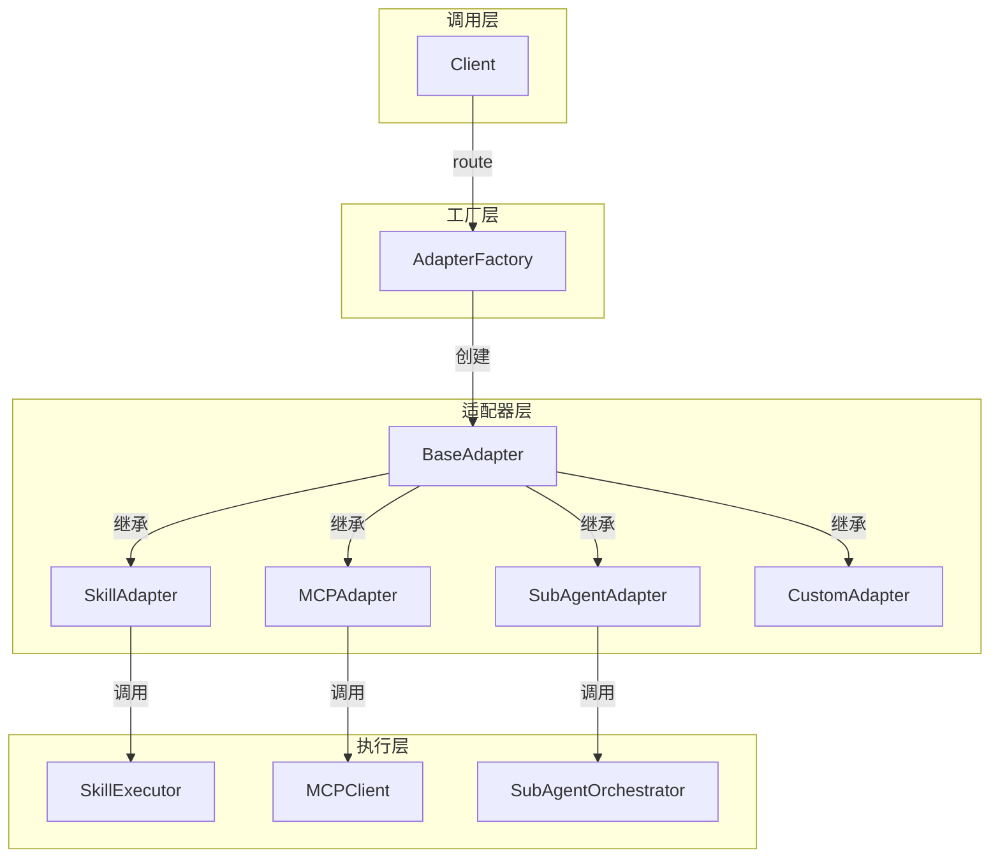

# Adapter 模块说明

> 本文档描述 Adapter 模块的设计与使用

---

## 一、模块概述

### 1.1 设计目标

建立统一的适配器架构，让所有工具执行器遵循相同接口，实现执行层彻底解耦。

### 1.2 核心特性

- **统一接口**：所有适配器遵循相同的执行接口
- **异步优先**：所有核心方法都是异步的
- **错误处理**：内置错误计数和健康检查
- **可观测性**：支持调用链追踪和性能监控
- **可扩展性**：动态注册新的适配器类型

### 1.3 架构图



---

## 二、核心组件

### 2.1 类型定义 (types.py)

#### AdapterType

适配器类型枚举：

```python
class AdapterType(Enum):
    SKILL = "skill"           # Skill 适配器
    MCP = "mcp"              # MCP 适配器
    SUBAGENT = "subagent"    # SubAgent 适配器
    CUSTOM = "custom"        # 自定义适配器
```

#### AdapterConfig

适配器配置：

```python
@dataclass
class AdapterConfig:
    type: AdapterType         # 适配器类型
    name: str                 # 适配器名称（唯一标识）
    enabled: bool = True      # 是否启用
    timeout: int = 30         # 超时时间（秒）
    metadata: Dict[str, Any]  # 元数据
```

#### ToolRequest

工具调用请求：

```python
@dataclass
class ToolRequest:
    tool_name: str                    # 工具名称
    parameters: Dict[str, Any]         # 工具参数
    session_id: str                    # 会话ID
    user_input: str                    # 用户原始输入
    intent: str                        # 意图
    metadata: Dict[str, Any]           # 元数据
```

#### ToolResponse

工具调用响应：

```python
@dataclass
class ToolResponse:
    success: bool                      # 执行是否成功
    data: Any                          # 返回数据
    error: Optional[str]               # 错误信息
    adapter_type: str                  # 适配器类型
    tool_name: str                     # 工具名称
    execution_time: float              # 执行时间（秒）
    source_type: str                   # 来源类型
    source_name: str                   # 来源名称
    chain_info: List[str]              # 调用链
```

### 2.2 适配器基类 (base.py)

#### BaseAdapter

所有适配器必须继承的抽象基类：

```python
class BaseAdapter(ABC):
    def __init__(self, config: AdapterConfig):
        self.config = config
        self._health_status = AdapterHealthStatus(healthy=True)
        self._capabilities = AdapterCapabilities()
        self._error_count = 0

    @abstractmethod
    async def initialize(self) -> None:
        """初始化适配器"""
        pass

    @abstractmethod
    async def execute(self, request: ToolRequest) -> ToolResponse:
        """执行工具调用"""
        pass

    @abstractmethod
    async def shutdown(self) -> None:
        """关闭适配器"""
        pass

    @abstractmethod
    def get_capabilities(self) -> AdapterCapabilities:
        """获取适配器能力描述"""
        pass

    async def health_check(self) -> AdapterHealthStatus:
        """健康检查（默认实现）"""
        pass

    async def execute_batch(self, requests: List[ToolRequest]) -> List[ToolResponse]:
        """批量执行（默认实现）"""
        pass

    async def execute_stream(self, request: ToolRequest) -> AsyncGenerator[str, None]:
        """流式执行（默认实现）"""
        pass
```

#### 内置方法

- `_execute_with_tracking()`: 带追踪的执行包装器
- `_create_response()`: 创建工具响应
- `_increment_error_count()`: 增加错误计数
- `_reset_error_count()`: 重置错误计数

### 2.3 适配器工厂 (factory.py)

#### AdapterFactory

管理适配器的注册、创建和路由：

```python
class AdapterFactory:
    def register_adapter_class(self, adapter_type, adapter_class):
        """注册适配器类"""
        pass

    async def create_adapter(self, config: AdapterConfig) -> BaseAdapter:
        """创建适配器实例"""
        pass

    async def route(self, tool_name: str, parameters: Dict) -> ToolResponse:
        """路由工具调用到正确的适配器"""
        pass

    async def route_to_adapter(self, adapter_name, tool_name, parameters) -> ToolResponse:
        """路由到指定适配器"""
        pass

    def list_adapters(self, adapter_type=None, enabled_only=True) -> List[BaseAdapter]:
        """列出适配器"""
        pass

    def list_tools(self, adapter_name=None) -> List[str]:
        """列出工具"""
        pass

    async def remove_adapter(self, adapter_name: str) -> bool:
        """移除适配器"""
        pass

    async def health_check(self, adapter_name=None) -> Dict:
        """健康检查"""
        pass

    async def shutdown_all(self) -> None:
        """关闭所有适配器"""
        pass

    def get_stats(self) -> Dict:
        """获取统计信息"""
        pass
```

---

## 三、使用指南

### 3.1 创建自定义适配器

```python
from src.adapters.core import BaseAdapter, AdapterConfig, ToolRequest, ToolResponse, AdapterType, AdapterCapabilities

class MyAdapter(BaseAdapter):
    """自定义适配器示例"""

    def __init__(self, config: AdapterConfig):
        super().__init__(config)
        self._connection = None

    async def initialize(self) -> None:
        """初始化连接"""
        self._connection = await self._connect()
        self._capabilities = AdapterCapabilities(
            supports_streaming=False,
            supports_batch=True,
            tools=["my_tool"]
        )

    async def execute(self, request: ToolRequest) -> ToolResponse:
        """执行工具"""
        if request.tool_name == "my_tool":
            result = await self._do_something(request.parameters)
            return ToolResponse.from_success(result, request.tool_name)
        else:
            return ToolResponse.from_error(f"Unknown tool: {request.tool_name}")

    async def shutdown(self) -> None:
        """关闭连接"""
        if self._connection:
            await self._connection.close()

    def get_capabilities(self) -> AdapterCapabilities:
        """获取能力描述"""
        return self._capabilities

    async def _connect(self):
        """建立连接"""
        # 实现连接逻辑
        pass

    async def _do_something(self, parameters):
        """执行实际操作"""
        # 实现业务逻辑
        pass
```

### 3.2 注册并使用适配器

```python
import asyncio
from src.adapters.core import AdapterFactory, AdapterConfig, AdapterType

async def main():
    # 创建工厂
    factory = AdapterFactory()

    # 注册适配器类
    factory.register_adapter_class(AdapterType.CUSTOM, MyAdapter)

    # 创建适配器实例
    config = AdapterConfig(
        type=AdapterType.CUSTOM,
        name="my_adapter",
        enabled=True,
        timeout=30
    )

    await factory.create_adapter(config)

    # 路由工具调用
    response = await factory.route(
        tool_name="my_tool",
        parameters={"param1": "value1"},
        session_id="test_session",
        user_input="测试输入"
    )

    if response.success:
        print(f"成功: {response.data}")
    else:
        print(f"失败: {response.error}")

    # 健康检查
    health = await factory.health_check("my_adapter")
    print(health)

    # 关闭所有适配器
    await factory.shutdown_all()

asyncio.run(main())
```

### 3.3 使用全局工厂

```python
from src.adapters.core import get_global_factory, reset_global_factory

# 获取全局工厂
factory = get_global_factory()

# 使用工厂
# ...

# 重置全局工厂（主要用于测试）
reset_global_factory()
```

---

## 四、测试

### 4.1 运行测试

```bash
# 运行所有测试
python -m pytest tests/test_adapter_factory.py -v

# 运行特定测试
python -m pytest tests/test_adapter_factory.py::TestAdapterFactory::test_create_adapter -v
```

### 4.2 测试覆盖

测试文件：`tests/test_adapter_factory.py`

测试类别：
- 配置测试（AdapterConfig, ToolRequest, ToolResponse）
- 工厂测试（注册、创建、路由、健康检查）
- MockAdapter 测试
- 全局工厂测试

---

## 五、最佳实践

### 5.1 错误处理

```python
async def execute(self, request: ToolRequest) -> ToolResponse:
    try:
        result = await self._do_work(request.parameters)
        return ToolResponse.from_success(result, request.tool_name)
    except Exception as e:
        return ToolResponse.from_error(str(e), request.tool_name)
```

### 5.2 调用链追踪

```python
async def execute(self, request: ToolRequest) -> ToolResponse:
    response = await self._do_work(request.parameters)

    # 添加调用链信息
    response.chain_info.append(f"{self.config.name}:{request.tool_name}")
    response.source_name = self.config.name

    return response
```

### 5.3 性能监控

```python
async def execute(self, request: ToolRequest) -> ToolResponse:
    start_time = time.time()

    result = await self._do_work(request.parameters)

    execution_time = time.time() - start_time
    return ToolResponse(
        success=True,
        data=result,
        execution_time=execution_time
    )
```

### 5.4 健康检查

```python
async def health_check(self) -> AdapterHealthStatus:
    status = await super().health_check()

    # 添加自定义健康检查
    if self._connection:
        is_connected = await self._connection.ping()
        status.healthy = status.healthy and is_connected
        status.message = "Connected" if is_connected else "Disconnected"

    return status
```

---

## 六、待实现适配器

### 6.1 SkillAdapter (P0)

封装现有 `SkillExecutor`：

```python
class SkillAdapter(BaseAdapter):
    def __init__(self, config: AdapterConfig):
        super().__init__(config)
        self._executor = SkillExecutor()

    async def execute(self, request: ToolRequest) -> ToolResponse:
        context = SkillContext(
            session_id=request.session_id,
            user_input=request.user_input,
            intent=request.intent
        )
        result = await self._executor.execute(request.tool_name, context)

        return ToolResponse(
            success=result.success,
            data=result.response,
            error=result.error
        )
```

### 6.2 MCPAdapter (P1)

封装现有 `MCPClient`：

```python
class MCPAdapter(BaseAdapter):
    def __init__(self, config: AdapterConfig):
        super().__init__(config)
        self._client = MCPClient()

    async def execute(self, request: ToolRequest) -> ToolResponse:
        # 解析工具名称：mcp.server_name.tool_name
        parts = request.tool_name.split(".")
        server_name = parts[1] if len(parts) > 1 else ""
        tool_name = parts[2] if len(parts) > 2 else request.tool_name

        result = await self._client.call_tool(server_name, tool_name, request.parameters)

        return ToolResponse(
            success=result.get("success", False),
            data=result.get("data"),
            error=result.get("error")
        )
```

### 6.3 SubAgentAdapter (P2)

封装现有 `SubAgentOrchestrator`：

```python
class SubAgentAdapter(BaseAdapter):
    def __init__(self, config: AdapterConfig):
        super().__init__(config)
        self._orchestrator = SubAgentOrchestrator()

    async def execute(self, request: ToolRequest) -> ToolResponse:
        input_data = SubAgentInput(
            query=request.user_input,
            context=request.parameters,
            session_id=request.session_id
        )

        output = await self._orchestrator.route(input_data)

        return ToolResponse(
            success=output.success,
            data=output.response,
            error=output.error
        )
```

---

## 七、常见问题

### Q1: 如何动态添加新的适配器类型？

```python
# 1. 创建适配器类
class NewAdapter(BaseAdapter):
    # 实现抽象方法
    pass

# 2. 添加新的 AdapterType
class AdapterType(Enum):
    # ... 现有类型
    NEW_TYPE = "new_type"

# 3. 注册到工厂
factory.register_adapter_class(AdapterType.NEW_TYPE, NewAdapter)
```

### Q2: 如何实现工具的动态注册？

```python
# 在适配器初始化时注册工具
async def initialize(self) -> None:
    tools = await self._fetch_available_tools()
    self._capabilities.tools = tools

    # 更新工厂的工具映射
    for tool in tools:
        factory._tool_mapping[tool] = self.config.name
```

### Q3: 如何实现适配器的热重载？

```python
async def reload_adapter(self, adapter_name: str):
    # 移除旧适配器
    await factory.remove_adapter(adapter_name)

    # 重新加载配置
    config = load_config(adapter_name)

    # 创建新适配器
    await factory.create_adapter(config)
```

---

*文档更新时间: 2026-03-20*
