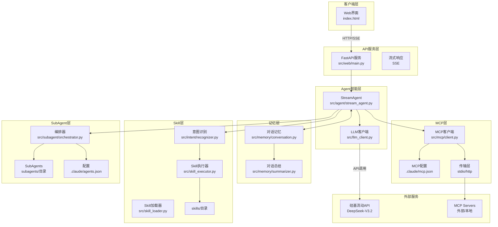

# 架构设计文档

> 本文档描述当前代码的实际架构状态

---

## 一、系统整体架构



---

## 二、核心模块说明

### 2.1 Web 模块 (`src/web/`)

| 文件 | 职责 |
|------|------|
| `main.py` | FastAPI 入口，静态文件服务，路由注册 |
| `dependencies.py` | 依赖注入，LLM 客户端单例 |
| `routes/chat.py` | 聊天接口 `/api/chat/stream`（SSE 批量化）、`/api/chat/message` |
| `routes/session.py` | 会话接口 `/api/session/{id}` |

### 2.1.1 前端模块 (`static/`)

| 文件 | 职责 |
|------|------|
| `index.html` | 单页应用，引入 marked.js CDN |
| `js/chat.js` | 流式聊天核心：rAF 批处理累积器 + AbortController + marked.js 渲染 |
| `js/app.js` | UI 控制器：智能滚动追踪 + 停止按钮 + 事件委托 |
| `js/memory.js` | localStorage 会话管理 |
| `css/style.css` | 暗色主题 + 流式光标 + 平滑滚动 + 代码块样式 |

**前端流式架构**：
```
SSE chunk 到达 → 累积到 _pendingChunks（不碰 DOM）
                → _scheduleRender() 调度 rAF
                → rAF 回调：renderMarkdown() → innerHTML（每帧最多 1 次）
                → 智能滚动（仅在用户位于底部时自动滚动）
```

**关键优化**：
- SSE 批量化：服务端按语义边界（句号、换行）或累积长度（8 字符）批量发送
- rAF 批处理：DOM 更新从每 chunk 一次降为每帧一次（60fps）
- marked.js：完整 GFM Markdown 渲染，流式时自动处理未闭合代码围栏
- AbortController：支持用户随时中断流式响应

### 2.2 Agent 模块 (`src/agent/`)

| 文件 | 职责 |
|------|------|
| `stream_agent.py` | 流式 Agent，Agentic Loop 多轮工具调用 |
| `hooks.py` | Agent Loop 钩子管理器 |
| `tool_registry.py` | 统一工具注册表 |
| `skill_registry.py` | Skill 扫描注册（含 prose 提取） |
| `tool.py` | 工具抽象定义 |
| `chain_tracker.py` | 调用链追踪器 |

**当前状态**：支持多轮工具调用（Agentic Loop）、Skill Context 注入、SubAgent 集成

### 2.3 Memory 模块 (`src/memory/`)

| 文件 | 职责 |
|------|------|
| `conversation.py` | 会话管理，消息存储 |
| `summarizer.py` | 对话总结，长对话压缩 |

### 2.4 Skill 模块

| 文件 | 职责 |
|------|------|
| `skill_loader.py` | Skill 资源加载器 |
| `skill_executor.py` | Skill 执行器 |
| `intent/recognizer.py` | 意图识别器 |

**功能**：意图识别 + Skill 匹配 + 执行

### 2.5 MCP 模块 (`src/mcp/`)

| 文件 | 职责 |
|------|------|
| `config.py` | MCP 配置加载器（支持 .claude/mcp.json） |
| `client.py` | MCP 客户端 |
| `transport/stdio.py` | STDIO 传输（本地进程） |
| `transport/http.py` | HTTP 传输（远程服务） |

**功能**：连接外部 MCP 服务器，调用工具和资源

### 2.6 SubAgent 模块 (`src/subagent/`)

| 文件 | 职责 |
|------|------|
| `config.py` | SubAgent 配置加载器（支持 .claude/agents.json） |
| `base_agent.py` | SubAgent 基类 |
| `orchestrator.py` | SubAgent 编排器 |

**功能**：多 Agent 协作，支持路由、并行、链式调用

---

## 三、已集成模块

### 3.1 Skills 模块 ✅

| 组件 | 状态 | 文件 |
|------|------|------|
| Skill 加载器 | ✅ | `src/skill_loader.py` |
| Skill 执行器 | ✅ | `src/skill_executor.py` |
| 意图识别器 | ✅ | `src/intent/recognizer.py` |
| StreamAgent 集成 | ✅ | 已集成 |

### 3.2 MCP 模块 ✅

| 组件 | 状态 | 文件 |
|------|------|------|
| 配置加载器 | ✅ | `src/mcp/config.py` |
| MCP 客户端 | ✅ | `src/mcp/client.py` |
| STDIO 传输 | ✅ | `src/mcp/transport/stdio.py` |
| HTTP 传输 | ✅ | `src/mcp/transport/http.py` |
| StreamAgent 集成 | ⏳ | 待集成 |

### 3.3 SubAgent 模块 ✅

| 组件 | 状态 | 文件 |
|------|------|------|
| 配置加载器 | ✅ | `src/subagent/config.py` |
| Agent 基类 | ✅ | `src/subagent/base_agent.py` |
| 编排器 | ✅ | `src/subagent/orchestrator.py` |
| StreamAgent 集成 | ✅ | `src/web/main.py` 启动时注册 |

---

## 三、Adapter 适配器模块 ✅

### 3.1 概述

适配器模块提供统一的工具执行接口，彻底解耦执行层。

| 组件 | 状态 | 文件 |
|------|------|------|
| `core/` 核心框架 | ✅ 已实现 | BaseAdapter, AdapterFactory, 类型定义 |
| `mcp/` MCP 适配器 | ✅ 已实现 | MCPAdapter, MCPClient |
| `subagent/` SubAgent 适配器 | ✅ 已实现 | SubAgentOrchestrator |
| `python/` Python 适配器 | ✅ 已实现 | PythonAdapter, 函数注册 |
| `http/` HTTP 适配器 | ✅ 已实现 | HTTPAdapter |

### 3.2 目录结构

```
src/adapters/
├── __init__.py                 # 模块入口
├── core/                       # 核心框架 ✅
│   ├── __init__.py
│   ├── types.py                # 类型定义
│   ├── base.py                 # 适配器基类
│   └── factory.py              # 适配器工厂
│
├── mcp/                        # MCP 适配器 ✅
│   ├── __init__.py
│   ├── adapter.py              # MCP 适配器实现
│   ├── client.py               # MCP 客户端
│   └── config.py               # MCP 配置加载器
│
├── subagent/                   # SubAgent 适配器 ✅
│   ├── __init__.py
│   ├── orchestrator.py         # SubAgent 编排器
│   └── config.py               # SubAgent 配置加载器
│
├── python/                     # Python 适配器 ✅
│   ├── __init__.py
│   ├── executor.py             # Python 函数执行器
│   ├── sandbox.py              # 沙箱安全机制
│   └── loader.py               # Python 模块加载器
│
└── http/                       # HTTP 适配器 ✅
    ├── __init__.py
    ├── client.py               # HTTP 客户端
    └── config.py               # HTTP 配置加载器
```

### 3.3 核心类型

```python
# 适配器类型
class AdapterType(Enum):
    SKILL = "skill"           # Skill 适配器
    MCP = "mcp"              # MCP 适配器
    SUBAGENT = "subagent"    # SubAgent 适配器
    CUSTOM = "custom"        # 自定义适配器

# 适配器配置
@dataclass
class AdapterConfig:
    type: AdapterType
    name: str
    enabled: bool = True
    timeout: int = 30
    metadata: Dict[str, Any] = field(default_factory=dict)

# 执行结果
@dataclass
class AdapterResult:
    success: bool
    data: Any
    error: Optional[str] = None
    metadata: Dict[str, Any] = field(default_factory=dict)

# 执行上下文
@dataclass
class SkillContext:
    session_id: str
    user_input: str
    intent: str
    chat_history: str = ""
    metadata: Dict[str, Any] = field(default_factory=dict)
```

### 3.4 适配器基类

```python
class BaseAdapter(ABC):
    """适配器基类 - 所有适配器必须继承"""

    def __init__(self, config: AdapterConfig):
        self.config = config
        self._health_status = AdapterHealthStatus(healthy=True)
        self._capabilities = AdapterCapabilities()
        self._error_count = 0

    @abstractmethod
    async def initialize(self) -> None:
        """初始化适配器"""
        pass

    @abstractmethod
    async def execute(self, request: ToolRequest) -> ToolResponse:
        """执行工具调用"""
        pass

    @abstractmethod
    async def shutdown(self) -> None:
        """关闭适配器"""
        pass

    @abstractmethod
    def get_capabilities(self) -> AdapterCapabilities:
        """获取适配器能力描述"""
        pass

    async def health_check(self) -> AdapterHealthStatus:
        """健康检查"""
        pass

    async def execute_batch(self, requests: List[ToolRequest]) -> List[ToolResponse]:
        """批量执行"""
        pass

    async def execute_stream(self, request: ToolRequest) -> AsyncGenerator[str, None]:
        """流式执行"""
        pass
```

**设计亮点**：
- 统一接口：所有适配器遵循相同的执行接口
- 异步优先：所有核心方法都是异步的
- 错误处理：内置错误计数和健康检查
- 可观测性：支持调用链追踪和性能监控

### 3.5 适配器工厂

```python
class AdapterFactory:
    """适配器工厂"""

    def register_adapter_class(self, adapter_type, adapter_class):
        """注册适配器类"""
        pass

    async def create_adapter(self, config: AdapterConfig) -> BaseAdapter:
        """创建适配器实例"""
        pass

    async def route(self, tool_name: str, parameters: Dict) -> ToolResponse:
        """路由工具调用到正确的适配器"""
        pass

    async def health_check(self, adapter_name: str = None) -> Dict:
        """健康检查"""
        pass

    async def shutdown_all(self) -> None:
        """关闭所有适配器"""
        pass
```

**核心功能**：
- 注册表模式：管理适配器类型
- 工厂模式：创建适配器实例
- 路由模式：自动分发工具调用
- 生命周期管理：初始化、健康检查、关闭

### 3.6 使用示例

```python
# 1. 创建自定义适配器
class MyAdapter(BaseAdapter):
    async def initialize(self):
        # 初始化连接
        pass

    async def execute(self, request: ToolRequest) -> ToolResponse:
        # 执行工具
        return ToolResponse.from_success(data="Hello")

    async def shutdown(self):
        # 清理资源
        pass

    def get_capabilities(self):
        return AdapterCapabilities(tools=["my_tool"])

# 2. 注册并使用
factory = AdapterFactory()
factory.register_adapter_class(AdapterType.CUSTOM, MyAdapter)

config = AdapterConfig(type=AdapterType.CUSTOM, name="my_adapter")
await factory.create_adapter(config)

# 3. 路由工具调用
response = await factory.route("my_tool", {"param": "value"})
```

### 3.7 已实现适配器功能

| 适配器 | 状态 | 说明 |
|--------|--------|------|
| MCPAdapter | ✅ | 封装现有 MCP 客户端，支持 STDIO/HTTP/SSE 传输 |
| SubAgentOrchestrator | ✅ | 封装现有 SubAgent 编排器，支持路由/并行/链式调用 |
| PythonAdapter | ✅ | 本地 Python 函数执行，支持同步/异步函数 |
| HTTPAdapter | ✅ | HTTP REST API 调用，支持 OpenAPI 规范 |

### 3.8 Agent 模块改进

| 组件 | 状态 | 说明 |
|------|------|------|
| StreamAgent | ✅ 已重构 | 基于 Agentic 架构，使用 Function Calling |
| ToolRegistry | ✅ 新增 | 统一工具注册表，管理所有类型工具 |
| ChainTracker | ✅ 新增 | 调用链追踪器，记录工具调用路径 |
| SharedState | ✅ 新增 | 主子 Agent 上下文共享机制 |

---

## 四、数据流向

### 4.1 当前流程（Agentic Loop 架构）

```
用户输入
    ↓
POST /api/chat/stream
    ↓
StreamAgent.chat_stream()
    ↓
┌───────────────────────────────────────────────┐
│ 1. 构建 messages                              │
│    - system prompt（含 Skill 上下文）         │
│    - 对话历史                                  │
│    - 用户输入                                  │
│                                               │
│ 2. 从 ToolRegistry 获取工具 schema            │
│                                               │
│ 3. Agent Loop (while iteration < max):        │
│    ├─ 调用 LLM（带 tools 参数）               │
│    ├─ Hook: before_model_call                │
│    ├─ Hook: after_model_call                 │
│    │                                          │
│    ├─ 如果 LLM 返回 tool_calls：              │
│    │   ├─ Hook: before_tool_calls            │
│    │   ├─ 实时流式输出工具调用过程             │
│    │   ├─ AdapterFactory 执行工具             │
│    │   ├─ 追加结果到 messages                 │
│    │   ├─ Hook: after_tool_calls             │
│    │   └─ 继续循环（让 LLM 看到结果）         │
│    │                                          │
│    └─ 如果无 tool_calls：                     │
│        ├─ 输出最终回答                        │
│        └─ break                               │
│                                               │
│ 4. 安全退出（max_iterations）                 │
│ 5. Hook: on_loop_end                         │
│ 6. 追加调用链签名                             │
│ 7. 保存到记忆                                 │
└───────────────────────────────────────────────┘
    ↓
SSE 响应（包含中间工具调用过程）
```

**关键特性**（参考 OpenClaw Agent Loop）：
- **多轮迭代**：LLM 调用工具后能看到结果，并决定是否继续调用
- **实时流式**：每轮工具调用过程实时推送给前端
- **Skill Context 注入**：SKILL.md 正文注入系统提示词（双重驱动）
- **Hook Points**：`before/after_model_call`、`before/after_tool_calls`、`on_loop_start/end`
- **安全限制**：`max_iterations`（默认 10）防止无限循环

### 4.2 Agentic 工作流

```
用户输入
    ↓
┌─────────────────────────────────────┐
│  StreamAgent                         │
│  ├─ 构建 messages（含历史）         │
│  ├─ 获取 ToolRegistry 的工具 schema │
│  └─ 调用 LLM（带 Function Calling） │
└─────────────────────────────────────┘
    ↓
┌─────────────────────────────────────┐
│  LLM 决策（自主选择工具）            │
│  - 不需要 IntentRecognizer          │
│  - 直接由 LLM Function Calling 驱动 │
└─────────────────────────────────────┘
    ↓
┌─────────────────────────────────────┐
│  ToolRegistry & AdapterFactory      │
│  ├─ MCP 工具                         │
│  ├─ SubAgent 工具                    │
│  ├─ Python 函数                      │
│  └─ 自定义工具                       │
└─────────────────────────────────────┘
    ↓
┌─────────────────────────────────────┐
│  执行 & 总结                         │
│  ├─ 执行所有 tool_calls              │
│  ├─ 收集结果                        │
│  └─ LLM 总结最终响应                │
└─────────────────────────────────────┘
    ↓
流式输出 + 调用链签名
```

---

## 五、配置文件

### 5.1 .claude/ 目录结构

```
.claude/
├── mcp.json              # MCP 服务器配置（Claude Code 标准）
├── agents.json           # SubAgent 配置
└── README.md             # 配置说明
```

### 5.2 MCP 配置示例 (.claude/mcp.json)

```json
{
  "mcpServers": {
    "filesystem": {
      "command": "npx",
      "args": ["-y", "@modelcontextprotocol/server-filesystem", "./data"]
    },
    "github": {
      "command": "npx",
      "args": ["-y", "@modelcontextprotocol/server-github"],
      "env": {"GITHUB_PERSONAL_ACCESS_TOKEN": "$GITHUB_TOKEN"}
    }
  }
}
```

### 5.3 SubAgent 配置示例 (.claude/agents.json)

```json
{
  "subagents": {
    "code-analyzer": {
      "description": "代码分析专家",
      "entry": "subagents/code-analyzer/agent.py",
      "enabled": true,
      "triggers": {
        "keywords": ["代码分析", "code review"]
      }
    }
  }
}
```

---

## 六、文件结构（实际）

```
project/
├── spec/                        # 规范文档
│   ├── Me2AI/                   # 用户维护
│   │   ├── 功能需求描述.md
│   │   ├── 非功能需求描述.md
│   │   ├── 技术约束.md
│   │   ├── 任务规划.md
│   │   └── prd_mcp_subagent_20260319.md
│   └── AI2AI/                   # AI 维护
│       ├── 架构设计.md
│       ├── 接口规范.md
│       ├── Skills模块说明.md
│       ├── MCP模块说明.md
│       └── SubAgent模块说明.md
│
├── src/                         # 源代码
│   ├── llm_client.py            # LLM 客户端
│   ├── skill_loader.py          # Skill 加载器
│   ├── skill_executor.py        # Skill 执行器
│   ├── adapter_manager.py       # 适配器管理器
│   │
│   ├── adapters/                # 适配器模块 ⭐ 新增
│   │   ├── __init__.py
│   │   └── core/                # 核心框架
│   │       ├── __init__.py
│   │       ├── types.py         # 类型定义
│   │       ├── base.py          # 适配器基类
│   │       └── factory.py       # 适配器工厂
│   │
│   ├── agent/                   # Agent 模块
│   │   ├── __init__.py
│   │   ├── tool.py              # 工具定义
│   │   ├── tool_registry.py     # 工具注册表
│   │   └── stream_agent.py      # 流式 Agent
│   │
│   ├── intent/                  # 意图识别
│   │   └── recognizer.py
│   │
│   ├── mcp/                     # MCP 模块
│   │   ├── config.py
│   │   ├── client.py
│   │   └── transport/
│   │
│   ├── subagent/                # SubAgent 模块
│   │   ├── config.py
│   │   ├── base_agent.py
│   │   └── orchestrator.py
│   │
│   ├── memory/                  # 记忆管理
│   │   ├── conversation.py
│   │   └── summarizer.py
│   │
│   └── web/                     # Web 服务
│       ├── main.py
│       ├── dependencies.py
│       └── routes/
│
├── tests/                       # 测试文件
│   └── test_adapter_factory.py  # 适配器工厂测试 ⭐ 新增
│
├── skills/                      # Skill 仓库
│   ├── _skill-template/
│   └── sqlite-query-skill/
│
├── subagents/                   # SubAgent 实现
│   ├── code-analyzer/
│   └── web-scraper/
│
├── static/                      # 前端静态文件（rAF 流式 + marked.js）
├── config/                      # 配置
├── data/                        # 数据
├── script/                      # 脚本
├── .env
├── requirements.txt
└── README.md
```

---

## 七、配置文件

```
project/
├── .claude/                     # Claude 配置目录
│   ├── mcp.json                 # MCP 配置
│   ├── agents.json              # SubAgent 配置
│   └── README.md                # 配置说明
│
├── spec/                        # 规范文档
│   ├── Me2AI/                   # 用户维护
│   │   ├── 功能需求描述.md
│   │   ├── 非功能需求描述.md
│   │   ├── 技术约束.md
│   │   ├── 任务规划.md
│   │   └── prd_mcp_subagent_20260319.md
│   └── AI2AI/                   # AI 维护
│       ├── 架构设计.md
│       ├── 接口规范.md
│       ├── Skills模块说明.md
│       ├── MCP模块说明.md
│       └── SubAgent模块说明.md
│
├── src/                         # 源代码
│   ├── llm_client.py            # LLM 客户端
│   ├── skill_loader.py          # Skill 加载器
│   ├── skill_executor.py        # Skill 执行器
│   ├── adapter_manager.py       # 适配器管理器
│   ├── intent/                  # 意图识别
│   │   └── recognizer.py
│   ├── mcp/                     # MCP 模块 ⭐ 新增
│   │   ├── config.py
│   │   ├── client.py
│   │   └── transport/
│   ├── subagent/                # SubAgent 模块 ⭐ 新增
│   │   ├── config.py
│   │   ├── base_agent.py
│   │   └── orchestrator.py
│   ├── agent/
│   │   └── stream_agent.py      # 流式 Agent
│   ├── memory/
│   │   ├── conversation.py      # 对话记忆
│   │   └── summarizer.py        # 对话总结
│   └── web/
│       ├── main.py              # FastAPI 入口
│       ├── dependencies.py      # 依赖注入
│       └── routes/
│           ├── chat.py          # 聊天接口
│           └── session.py       # 会话接口
│
├── skills/                      # Skill 仓库
│   ├── _skill-template/         # 模板
│   └── sqlite-query-skill/      # SQLite 查询
│
├── subagents/                   # SubAgent 实现 ⭐ 新增
│   ├── code-analyzer/
│   └── web-scraper/
│
├── static/                      # 前端静态文件（rAF 流式 + marked.js）
├── config/                      # 配置
├── data/                        # 数据
├── script/                      # 脚本
├── .env
├── requirements.txt
└── README.md
```

---

## 七、技术栈

| 层级 | 技术选型 | 用途 |
|------|----------|------|
| 前端 | HTML5 + CSS3 + JavaScript + marked.js | Web 聊天界面（rAF 流式渲染） |
| 后端框架 | FastAPI | 高性能 API 服务 |
| LLM 客户端 | OpenAI SDK | 调用硅基流动 API |
| 模型 | DeepSeek-V3.2 | 语言理解与生成 |
| 流式传输 | SSE | 实时响应 |
| 技能系统 | Skills | 核心能力层 |
| MCP | Claude Code 标准 | 外部服务集成 |
| SubAgent | Agents as Tools | 多 Agent 协作 |

---

## 八、启动流程

```
1. 加载 .env 环境变量
2. 创建 FastAPI 应用
3. 注册路由和中间件
4. 初始化记忆管理器
5. 初始化能力系统
   ├─ IntentRecognizer (Skills)
   ├─ MCPClient (MCP)
   └─ SubAgentOrchestrator (SubAgents)
6. 挂载静态文件
7. 开始监听请求
```

---

## 九、待完成事项

| 优先级 | 任务 | 说明 |
|--------|------|------|
| P0 | StreamAgent 集成 | 统一路由 Skills/MCP/SubAgent |
| P1 | MCP 工具调用优化 | LLM 工具选择 |
| P1 | SubAgent 示例实现 | code-analyzer, web-scraper |
| P2 | SSE 传输支持 | MCP SSE 传输 |

---

## 五、文件结构（实际）

```
project/
├── spec/                        # 规范文档
│   ├── Me2AI/                   # 用户维护
│   │   ├── 功能需求描述.md
│   │   ├── 非功能需求描述.md
│   │   ├── 技术约束.md
│   │   └── 任务规划.md
│   └── AI2AI/                   # AI 维护
│       ├── 架构设计.md
│       ├── 接口规范.md
│       └── Skills模块说明.md
│
├── src/                         # 源代码
│   ├── llm_client.py            # LLM 客户端
│   ├── skill_loader.py          # Skill 加载器
│   ├── adapter_manager.py       # 适配器管理器
│   ├── agent/
│   │   └── stream_agent.py      # 流式 Agent
│   ├── memory/
│   │   ├── conversation.py      # 对话记忆
│   │   └── summarizer.py        # 对话总结
│   └── web/
│       ├── main.py              # FastAPI 入口
│       ├── dependencies.py      # 依赖注入
│       └── routes/
│           ├── chat.py          # 聊天接口
│           └── session.py       # 会话接口
│
├── adapters/                    # 适配器模块
│   ├── core/                    # 核心框架
│   ├── http/                    # HTTP 适配器
│   ├── mcp/                     # MCP 适配器
│   └── shell/                   # Shell 适配器
│
├── skills/                      # Skill 仓库
│   ├── _skill-template/         # 模板
│   ├── sqlite-query-skill/      # SQLite 查询
│   ├── http-example-skill/      # HTTP 示例
│   ├── mcp-example-skill/       # MCP 示例
│   └── shell-example-skill/     # Shell 示例
│
├── static/                      # 前端静态文件（rAF 流式 + marked.js）
├── config/                      # 配置
├── data/                        # 数据
├── script/                      # 脚本
├── .env
├── requirements.txt
└── README.md
```

---

## 八、技术栈

| 层级 | 技术选型 | 用途 |
|------|----------|------|
| 前端 | HTML5 + CSS3 + JavaScript + marked.js | Web 聊天界面（rAF 流式渲染） |
| 后端框架 | FastAPI | 高性能 API 服务 |
| LLM 客户端 | OpenAI SDK | 调用硅基流动 API |
| 模型 | DeepSeek-V3.2 | 语言理解与生成 |
| 流式传输 | SSE | 实时响应 |
| 技能系统 | Skills | 核心能力层 |
| 适配器 | 自定义 | 多协议支持 |

---

## 九、启动流程

```
1. 加载 .env 环境变量
2. 创建 FastAPI 应用
3. 注册路由和中间件
4. 初始化记忆管理器
5. 挂载静态文件
6. 开始监听请求
```

---

## 十、待完成事项

| 优先级 | 任务 | 说明 |
|--------|------|------|
| P0 | SkillAdapter | 实现 Skill 适配器，封装 SkillExecutor |
| P1 | MCPAdapter | 实现 MCP 适配器，封装 MCPClient |
| P2 | SubAgentAdapter | 实现 SubAgent 适配器，封装 SubAgentOrchestrator |
| P1 | StreamAgent 集成 | 在 StreamAgent 中集成 AdapterFactory |
| P2 | 配置管理 | 支持从配置文件自动创建适配器 |

---

## 十一、已完成事项 ✅

| 任务ID | 任务名称 | 完成时间 |
|--------|----------|----------|
| T002 | Adapter 基类与工厂设计 | 2026-03-20 |
| T001 | Tool 定义与注册表 | 2026-03-19 |
| T012 | Skill 注册与执行集成 | 2026-03-24 |

---

## 十二、2026-03-24 修复记录

### 修复的问题

| 问题 | 原因 | 解决方案 |
|------|------|----------|
| `'AdapterFactory' object has no attribute 'initialize'` | `AdapterFactory` 缺少 `initialize` 方法 | 添加空实现方法（工厂无需异步初始化） |
| `Error code: 400 - Input should be a valid list` | `tools` 参数格式错误，传递了整个 schema 而非列表 | 从 schema 中提取 `tools` 列表 |
| Skills 未被注册到 ToolRegistry | 服务启动时未调用注册逻辑 | 在 `web/main.py` lifespan 中调用 `register_skills_to_registry` |
| Skills 无法执行 | Tool 缺少 `handler` 函数 | 加载 `executor.py` 并创建异步 handler |

### 修改的文件

| 文件 | 修改内容 |
|------|----------|
| `src/adapters/core/factory.py` | 添加 `initialize()` 方法；修改 `route()` 支持 ToolRegistry 工具执行 |
| `src/agent/stream_agent.py` | 修复 `tools` 参数提取逻辑 |
| `src/agent/skill_registry.py` | 重写，支持加载 executor.py 并创建 handler |
| `src/web/main.py` | 在 lifespan 中注册 Skills |
| `src/web/routes/chat.py` | 添加 `/api/chat/tools` 端点 |

### 验证结果

```
查询"张三" → Skill 正确执行，返回员工详细信息
查询"王二" → Skill 正确执行，返回数据库所有员工列表
```

---

*文档更新时间: 2026-03-24*
