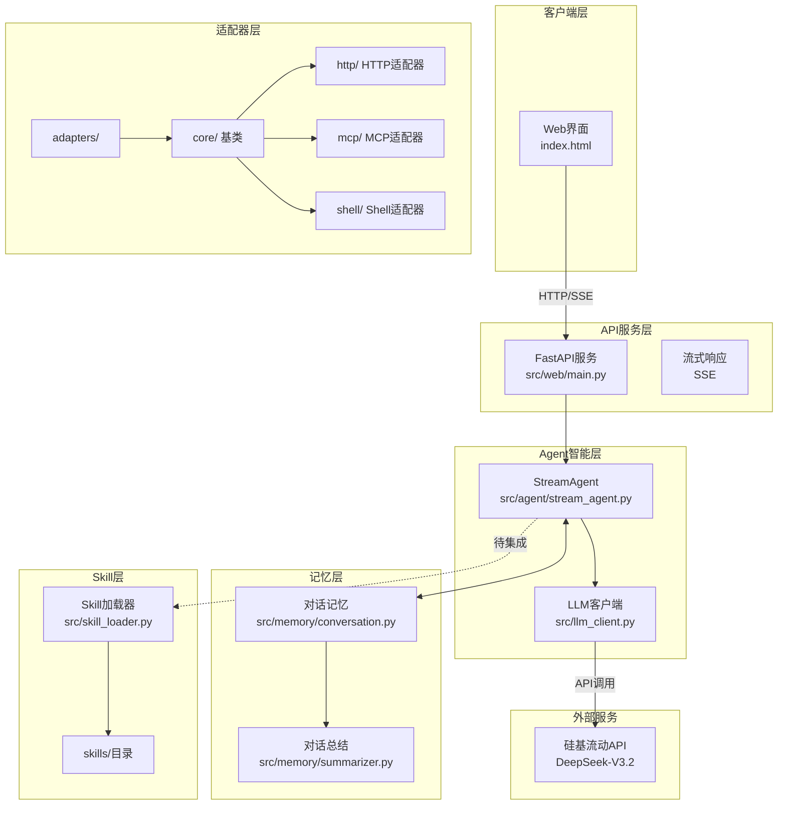

# 架构设计文档

> 本文档描述当前代码的实际架构状态

---

## 一、系统整体架构



---

## 二、核心模块说明

### 2.1 Web 模块 (`src/web/`)

| 文件 | 职责 |
|------|------|
| `main.py` | FastAPI 入口，静态文件服务，路由注册 |
| `dependencies.py` | 依赖注入，LLM 客户端单例 |
| `routes/chat.py` | 聊天接口 `/api/chat/stream`、`/api/chat/message` |
| `routes/session.py` | 会话接口 `/api/session/{id}` |

### 2.2 Agent 模块 (`src/agent/`)

| 文件 | 职责 |
|------|------|
| `stream_agent.py` | 流式 Agent，封装 LLM 调用和记忆管理 |

**当前状态**：仅支持直接调用 LLM，**未集成 Skill 调用**

### 2.3 Memory 模块 (`src/memory/`)

| 文件 | 职责 |
|------|------|
| `conversation.py` | 会话管理，消息存储 |
| `summarizer.py` | 对话总结，长对话压缩 |

### 2.4 Skill 模块 (`src/skill_loader.py`)

**功能**：加载 Skill 目录下的资源文件
**支持**：解析 SKILL.md 的 YAML Front Matter

---

## 三、适配器模块（adapters/）

### 3.1 概述

适配器模块支持多种类型的 Skill 执行方式，与 Skill 层解耦，独立演进。

| 组件 | 状态 | 说明 |
|------|------|------|
| `core/` 基类 | ✅ 已实现 | BaseAdapter, AdapterFactory, 类型定义 |
| `http/` 适配器 | ✅ 已实现 | HTTP 客户端, OpenAPI 解析器 |
| `mcp/` 适配器 | ✅ 已实现 | MCP 客户端, stdio 传输 |
| `shell/` 适配器 | ✅ 已实现 | 命令执行器, 沙箱环境 |
| Skill 集成 | ⏳ 待实现 | 需要实现 SkillExecutor |

### 3.2 目录结构

```
adapters/
├── core/                        # 核心框架
│   ├── __init__.py
│   ├── types.py                 # 类型定义
│   ├── base_adapter.py          # 适配器基类
│   ├── adapter_factory.py       # 适配器工厂
│   └── schema_validator.py      # Schema 验证器
│
├── http/                        # HTTP/OpenAPI 适配器
│   ├── __init__.py
│   ├── base.py                  # HTTP 基类
│   ├── openapi_parser.py        # OpenAPI 解析器
│   └── client.py                # HTTP 客户端
│
├── mcp/                         # MCP 适配器
│   ├── __init__.py
│   ├── base.py                  # MCP 基类
│   ├── client.py                # MCP 客户端
│   └── servers/                 # MCP Server 实现
│
└── shell/                       # Shell/CLI 适配器
    ├── __init__.py
    ├── base.py                  # Shell 基类
    ├── executor.py              # 命令执行器
    └── sandbox.py               # 沙箱环境
```

### 3.3 核心类型

```python
# 适配器类型
class AdapterType(Enum):
    PYTHON = "python"    # Python 执行器
    HTTP = "http"        # HTTP REST API
    MCP = "mcp"          # Model Context Protocol
    SHELL = "shell"      # Shell 命令

# 适配器配置
@dataclass
class AdapterConfig:
    type: AdapterType
    name: str
    enabled: bool = True
    timeout: int = 30
    metadata: Dict[str, Any] = field(default_factory=dict)

# 执行结果
@dataclass
class AdapterResult:
    success: bool
    data: Any
    error: Optional[str] = None
    metadata: Dict[str, Any] = field(default_factory=dict)

# 执行上下文
@dataclass
class SkillContext:
    session_id: str
    user_input: str
    intent: str
    chat_history: str = ""
    metadata: Dict[str, Any] = field(default_factory=dict)
```

### 3.4 适配器基类

```python
class BaseAdapter(ABC):
    """适配器基类 - 所有适配器必须继承"""

    def __init__(self, config: AdapterConfig):
        self.config = config

    @abstractmethod
    async def execute(
        self,
        context: SkillContext,
        input_data: Dict[str, Any]
    ) -> AdapterResult:
        """执行适配器"""
        pass

    @abstractmethod
    async def health_check(self) -> bool:
        """健康检查"""
        pass
```

### 3.5 HTTP 适配器

**用途**：调用 REST API

**特性**：
- 支持 OpenAPI 3.0 规范解析
- 多种认证方式（Bearer, API Key, Basic）
- 自动重试和错误处理

**配置示例**：
```yaml
# config/adapters.yaml
http:
  order-api:
    base_url: https://api.example.com
    openapi_path: adapters/http/specs/order-api.yaml
    auth:
      type: bearer
      token_env: ORDER_API_TOKEN
```

### 3.6 MCP 适配器

**用途**：连接 MCP Server

**特性**：
- 支持 stdio 传输
- JSON-RPC 2.0 协议
- 工具调用和资源访问

### 3.7 Shell 适配器

**用途**：执行命令行工具

**特性**：
- 命令白名单机制
- 沙箱执行环境
- 超时控制和输出捕获

---

## 四、数据流向

### 4.1 当前流程（无 Skill 集成）

```
用户输入
    ↓
POST /api/chat/stream
    ↓
StreamAgent.chat_stream()
    ↓
┌─────────────────────┐
│ 1. 获取对话历史      │
│ 2. 构建消息列表      │
│ 3. 调用 LLM         │
│ 4. 流式输出         │
│ 5. 保存到记忆       │
└─────────────────────┘
    ↓
SSE 响应
```

### 4.2 目标流程（集成 Skill）

```
用户输入
    ↓
POST /api/chat/stream
    ↓
StreamAgent.chat_stream()
    ↓
┌─────────────────────┐
│ 1. 意图识别（新增）  │
│ 2. Skill 匹配（新增）│
│    ↓                │
│    有匹配 → 执行 Skill → 返回结果
│    无匹配 → 调用 LLM → 返回结果
└─────────────────────┘
    ↓
SSE 响应
```

**详细设计**：见 `spec/AI2AI/Skills模块说明.md` 的"待实现功能"部分

---

## 五、文件结构（实际）

```
project/
├── spec/                        # 规范文档
│   ├── Me2AI/                   # 用户维护
│   │   ├── 功能需求描述.md
│   │   ├── 非功能需求描述.md
│   │   ├── 技术约束.md
│   │   └── 任务规划.md
│   └── AI2AI/                   # AI 维护
│       ├── 架构设计.md
│       ├── 接口规范.md
│       └── Skills模块说明.md
│
├── src/                         # 源代码
│   ├── llm_client.py            # LLM 客户端
│   ├── skill_loader.py          # Skill 加载器
│   ├── adapter_manager.py       # 适配器管理器
│   ├── agent/
│   │   └── stream_agent.py      # 流式 Agent
│   ├── memory/
│   │   ├── conversation.py      # 对话记忆
│   │   └── summarizer.py        # 对话总结
│   └── web/
│       ├── main.py              # FastAPI 入口
│       ├── dependencies.py      # 依赖注入
│       └── routes/
│           ├── chat.py          # 聊天接口
│           └── session.py       # 会话接口
│
├── adapters/                    # 适配器模块
│   ├── core/                    # 核心框架
│   ├── http/                    # HTTP 适配器
│   ├── mcp/                     # MCP 适配器
│   └── shell/                   # Shell 适配器
│
├── skills/                      # Skill 仓库
│   ├── _skill-template/         # 模板
│   ├── sqlite-query-skill/      # SQLite 查询
│   ├── http-example-skill/      # HTTP 示例
│   ├── mcp-example-skill/       # MCP 示例
│   └── shell-example-skill/     # Shell 示例
│
├── static/                      # 静态文件
├── config/                      # 配置
├── data/                        # 数据
├── script/                      # 脚本
├── .env
├── requirements.txt
└── README.md
```

---

## 六、技术栈

| 层级 | 技术选型 | 用途 |
|------|----------|------|
| 前端 | HTML5 + CSS3 + JavaScript | Web 聊天界面 |
| 后端框架 | FastAPI | 高性能 API 服务 |
| LLM 客户端 | OpenAI SDK | 调用硅基流动 API |
| 模型 | DeepSeek-V3.2 | 语言理解与生成 |
| 流式传输 | SSE | 实时响应 |
| 技能系统 | Skills | 核心能力层 |
| 适配器 | 自定义 | 多协议支持 |

---

## 七、启动流程

```
1. 加载 .env 环境变量
2. 创建 FastAPI 应用
3. 注册路由和中间件
4. 初始化记忆管理器
5. 挂载静态文件
6. 开始监听请求
```

---

## 八、待完成事项

| 优先级 | 任务 | 说明 |
|--------|------|------|
| P0 | 意图识别模块 | `src/intent/recognizer.py` |
| P0 | Skill 执行器 | `src/skill_executor.py` |
| P0 | Agent 集成 | 修改 `stream_agent.py` |

---

*文档更新时间: 2026-03-19*
